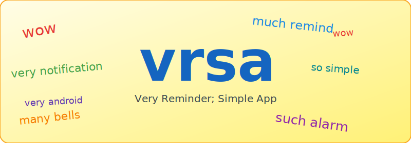

<div align="center">
  
</div>

# Very Reminder; Simple App (VRSA) — Specification

*Wordplay on "Very Simple Reminder App", in the style of a doge meme. Pronounced vur-sah.*

---

## Overview

A headless Android app that reads a plain-text config file and fires
notifications at scheduled times. There is no UI. Configuration is done
entirely by editing a text file with any file manager or text editor app.

---

## Behaviour

- **The app must be launched at least once** to schedule reminders.
  Until then, no notifications will fire.
- On first launch, the app requests notification permission (Android 13+),
  schedules an exact alarm for each reminder in the config file, then closes.
  There is no visible UI.
- **Re-launch the app after editing the config file** to reschedule alarms.
  Changes do not take effect until the app is opened again.
- Each alarm fires at exactly the scheduled time, then automatically reschedules
  itself for the next occurrence of that reminder.
- Alarms are rescheduled automatically after a reboot — no user action required.

---

## Config File

**Location**

```
/sdcard/Android/data/com.vrsa.app/files/reminders.txt
```

`/sdcard/` is Android's standard symlink to the device's built-in user-accessible
storage (`/storage/emulated/0/`). This is part of the phone's internal flash
storage and is present on all normal Android devices — no SD card is required.

This directory is created automatically on first app launch. If the config file
does not exist, the app creates it with commented-out format examples. Edit it
with any Android file manager or text editor that supports the path above.

**Format**

One reminder per line:

```
HH:MM  <days>  <label>
```

| Field   | Description                                                         |
|---------|---------------------------------------------------------------------|
| `HH:MM` | 24-hour time in `HH:MM` format (e.g. `08:00`, `22:30`)            |
| `days`  | `daily`, or a comma-separated list of day abbreviations (see below) |
| `label` | Free text shown in the notification body                            |

Fields are separated by one or more spaces or tabs.

**Day abbreviations**

`Mon` `Tue` `Wed` `Thu` `Fri` `Sat` `Sun` (case-insensitive)

**Comments and blank lines**

Lines starting with `#` and blank lines are ignored.

**Example**

```
# Weekday reminders
08:00  Mon,Tue,Wed,Thu,Fri  Take medication
12:30  daily                Drink water
22:30  Mon,Wed,Fri          Evening reminder

# Weekend
09:00  Sat,Sun              Morning walk
```

---

## Notifications

- Delivered as a standard Android notification (not a full-screen alarm).
- Title: `Reminder`
- Body: the label text from the config file.
- Priority: high (causes a heads-up notification on most devices).
- Auto-dismissed when tapped.

---

## Permissions

| Permission              | When requested              | Purpose                                        |
|-------------------------|-----------------------------|------------------------------------------------|
| `POST_NOTIFICATIONS`    | On first launch (Android 13+) | Required to show notifications               |
| `USE_EXACT_ALARM`       | Granted automatically (Android 13+) | Required to fire alarms at exact times |
| `RECEIVE_BOOT_COMPLETED`| Granted automatically       | Reschedule alarms after reboot                 |

No network, location, or other permissions are used.

---

## Testing

Use adb to push a test config file and trigger an alarm shortly in the future:

```bash
# Write a reminder 2 minutes from now (adjust time as needed)
echo "HH:MM  daily  Test reminder" > /tmp/reminders.txt
adb push /tmp/reminders.txt /sdcard/Android/data/com.vrsa.app/files/reminders.txt
```

Then re-launch the app to schedule the alarm. The notification will appear at
the specified time.

`adb` is not on the system PATH — see AGENTS.md for the full path.

---

## Limitations

- Reminders are recurring only. There is no one-time / dated reminder support.
- Malformed lines (wrong time format, unknown day names, missing label) are
  silently skipped.
- If the user denies notification permission, no notifications will be shown.
  Re-launch the app to be prompted again, or grant the permission manually in
  system settings.
- **The app does not watch the config file for changes.** After editing
  `reminders.txt`, re-launch the app to reschedule alarms. Removed reminders
  will fire one final time at their next scheduled occurrence before stopping.
- On some devices (particularly Samsung, Xiaomi, and other OEM Android skins),
  aggressive battery management can interfere with exact alarms. If notifications
  stop arriving, go to Settings → Battery → Reminders and set it to
  "Unrestricted" or "Don't optimise". The exact path varies by device.
